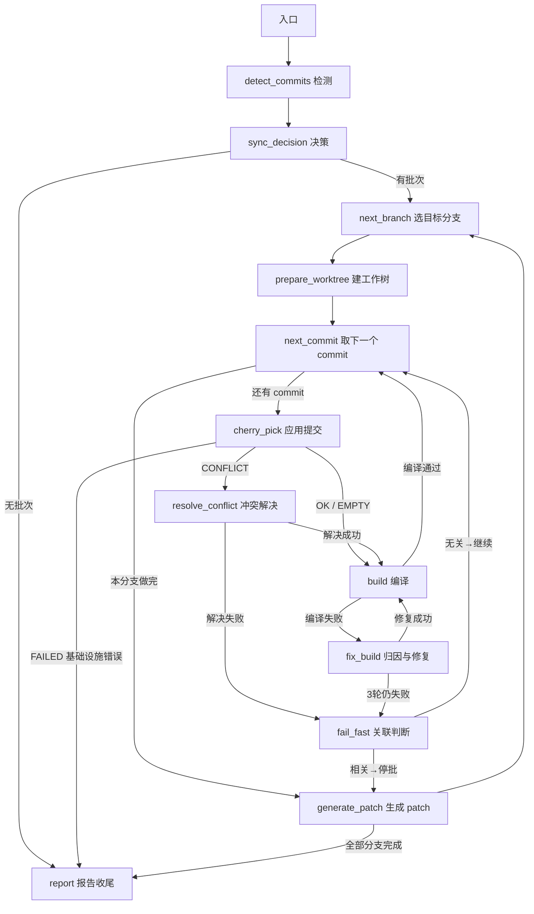
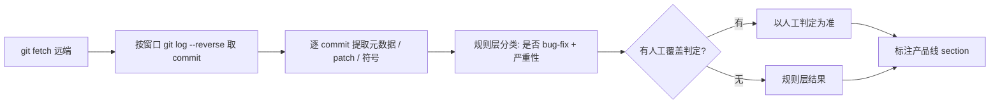
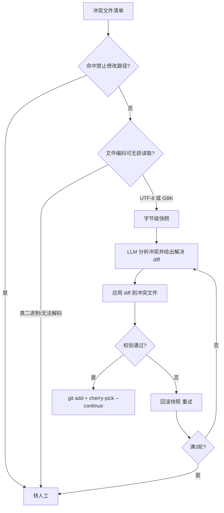
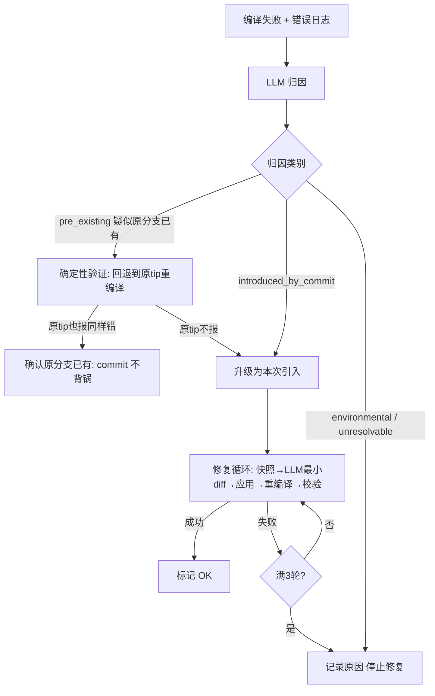
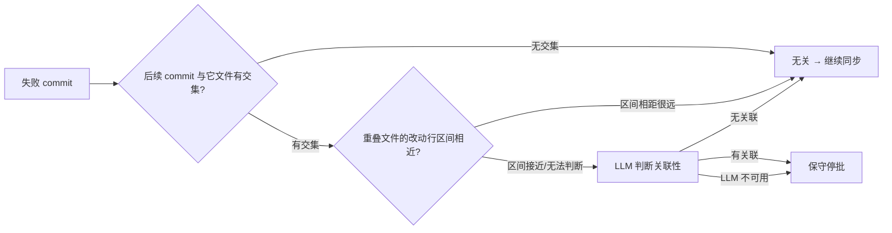

# 分支同步引擎执行流程说明

> 用途：演示/讲解文档。用自然语言描述引擎的整体执行流程与各核心模块的判断逻辑，
> 关键环节配流程图与表格。内容与代码实现一致（`src/bsa/graph/*`、`src/bsa/agents/*`）。

---

## 1. 系统定位

**分支同步 Agent（Branch Sync Agent，简称 BSA）** 解决一个问题：

> 开发分支（如 `br_v4.33_5200_CU_develop_20260518`）上合入了 bug-fix 提交，需要把这些提交
> 逐个同步（cherry-pick + 编译验证 + 生成 patch）到各产品线分支（如 `br_v4.33_develop_20260702`）。

**架构原则**（贯穿全文的核心思想）：

- **Workflow 控制确定性流程**：做什么、按什么顺序做、失败往哪走，全部由流程图（LangGraph）决定，可检查点续跑。
- **Agent 只做复杂判断**：需要语义理解的地方（判定是否 bug-fix、解决冲突、归因编译错误、判断提交关联性）才调用 LLM。
- **安全闸门（SafetyEnforcer）永远高于 LLM**：禁止修改的路径、禁止同步的分支、单次修改行数上限，LLM 不可覆盖。

---

## 2. 整体流程

### 2.1 两条入口

引擎有两个启动方式，共享同一套"同步阶段"：

| 入口 | 场景 | 区别 |
|---|---|---|
| **自动周期**（`bsa run-cycle`） | 每天定时扫描源分支 | 完整链路：检测 → 决策 → 同步 |
| **手动同步**（`bsa sync --sha`，web B 区） | 用户在页面勾选 commit 直同步 | 跳过检测/决策（用户勾选 = 人工审核通过），直接同步 |

手动同步还有两道细节：

- **批次按合入时间排序**：用户勾选顺序可能乱，执行前统一按 commit 合入时间从旧到新重排，保证依赖顺序正确。
- **编译型号按产品线自动选择**：目标分支在 branch.md 里属于哪个产品线（如「组网产品分支」），就编哪个型号（如 `RTL9617C 5200` + `X86 5200B`）；产品线没配置型号就直接报错停止，绝不用错脚本。

### 2.2 整体流程图

> 图中所有"回路"（分支循环、commit 循环、型号循环、修复重试）都是通过**读状态的条件边**实现的，
> 不是代码里的 for 循环——所以任意一步中断，都能从 checkpoint 续跑，不重做已完成的部分。

### 2.3 阶段总览

| 阶段 | 节点 | 做什么 | 失败去向 |
|---|---|---|---|
| 检测 | detect_commits | 扫窗口 commit、分类、建同源矩阵 | — |
| 决策 | sync_decision | 判四态、冻结批次、解析编译型号 | — |
| 工作树 | prepare_worktree | 从远端 tip 建/复用 worktree | 报告 |
| 应用 | cherry_pick | 逐 commit 应用 | 冲突→解决；基础设施错→报告 |
| 冲突 | resolve_conflict | LLM 解决冲突 | 失败→fail-fast |
| 编译 | build | docker 内按型号编译 | 失败→修复 |
| 修复 | fix_build | 归因 + 最小修复 | 3 轮失败→fail-fast |
| 停批 | fail_fast | 判断后续 commit 关联性 | 相关→停批，无关→继续 |
| 交付 | generate_patch | 生成 patch、汇总状态 | — |
| 收尾 | report | 写报告、落终态 | — |

---

## 3. 核心模块流程

### 3.1 检测模块（detect_commits）

**需求逻辑**：找出源分支在一个时间窗口内"合入的、值得同步的提交"。

**核心判断**：

- **分类三要素**（`classify_commit`）：`is_bug_fix`（是否 bug 修复）、`risk`（严重性 low/medium/high）、`needs_agent`（规则拿不准，需要 LLM 兜底）。
- **人工覆盖优先**：`judgments.json` 里的人工判定（`judgments.json` 手动维护）优先级最高，机器判定的结果可以被人改掉。
- **同源矩阵**：branch.md 的 section（产品线）就是"同源组"，组内分支互相为源/目标——这是判断"该不该同步到某分支"的基础。

### 3.2 决策模块（sync_decision）

**需求逻辑**：对每个候选 commit，判定它相对"某个目标分支"该不该同步、怎么处理。

**四态结论**（`conclude_pair`）：

| 结论 | 含义 | 处置 |
|---|---|---|
| **NeedSync** | 目标分支缺这个修复，需要同步 | 进入该分支的同步批次 |
| **AlreadyIncluded** | 目标分支已经包含这个修复 | 跳过 |
| **OutOfScope** | 目标分支不该同步它（非同源产品线 / 类型不符 / 命中禁同步清单） | 跳过并记录原因 |
| **ManualReview** | 判定有风险或有歧义，机器不敢拍板 | 转人工，进待办区 |

**LLM 兜底**（`SyncDecisionAgent`）：

- 规则层拿不准（`needs_agent`）的 commit，交 LLM 判定 is_bug_fix 和严重性。
- **规则层已判的严重性，LLM 不得覆盖**——规则优先级永远高于 LLM。
- 判定结果写回缓存（judgments），下次直接命中，减少 LLM 调用。

> 手动同步不需要这一步：用户在页面勾选 commit = 人工审核通过，全部按 NeedSync 处理。

### 3.3 冲突解决模块（resolve_conflict / ConflictAgent）

**需求逻辑**：cherry-pick 冲突时，让 LLM 理解"两边各要什么"，给出安全的合并结果。

**核心判断**：

- **安全前置**：冲突文件命中 `forbidden_paths`（如 `config/`、`.env`）→ 直接转人工，LLM 不允许碰。
- **编码无损**：RCIOS 源文件常见 GBK 中文注释。UTF-8 读不动的文件用 GB18030（GBK 超集）兜底，解决冲突后**非冲突行的字节原样保留**；连 GB18030 都解不开的真二进制才转人工。
- **校验四关**：冲突标记消失 + `git diff --check` 干净 + 只改了冲突文件 + 未触安全红线，全过才算解决。
- **回滚重试**：每轮先快照（字节级），失败原样恢复，最多 3 轮。
- **质量底线**：提示 LLM 必须理解功能与合入目的综合判断，禁止机械删标记、禁止无理由丢弃任一边的改动。

### 3.4 编译模块（build）

**需求逻辑**：每个 commit 应用后，在目标分支的独立工作树上按"该产品线要求的型号"逐个编译验证。

**产品线 → 编译型号**（新增能力，重点演示）：

| 产品线（branch.md section） | 编译型号 | 实际脚本 |
|---|---|---|
| 组网产品分支 | 5200、5200B | `RTL9617C_build.sh 5200`、`X86.sh 5200B` |
| （其他产品线未配置） | — | 报错停止任务，不静默用错脚本 |

- 型号列表随目标分支写入状态，**不是全局一个型号**（这是本次修复的核心）。
- 自动周期里每个目标分支各自解析；查不到产品线/型号 → 该分支报错移出，原因进待办区。

**编译执行**：

- docker 起独立容器（挂载 worktree）→ `code_update.sh -d` 拉组件 → 执行产品线脚本。
- 批次开头 / 改了公共文件 → clean 全量编译；commit 之间增量编译。
- 多个型号**串行**编译，任一型号失败即停该 commit。

**成功判定三查**（防"假成功"）：

| 检查 | 内容 |
|---|---|
| 容器 | 编译命令退出码为 0 |
| 日志 | 出现该型号的成功标志 |
| 产物 | 目标产物存在且完整 |

### 3.5 编译错误归因与修复模块（fix_build / BuildAgent）

**需求逻辑**：编译失败时，先判断"这个错是不是这次同步引入的"，是才允许修，且只能最小改动。

**核心判断**：

- **归因四类**：`introduced_by_commit`（本次引入）/ `pre_existing`（原分支已有）/ `environmental`（环境问题）/ `unresolvable`（无法修复）。
- **pre_existing 不靠 LLM 嘴说**，走**确定性对比**：把该 commit 改动的文件回退到目标分支原始 tip → 重新编译 → 对比错误签名。原 tip 复现相同错误 = 确认原分支已有，本 commit 不背锅。
- **修复边界**：只允许改「本次 commit 改过的文件 + 报错日志指向的文件」，SafetyEnforcer 强制，超界直接拒。
- **快照回滚**：每轮先快照，失败恢复重试，最多 3 轮。
- 归因结果（`reason`）随投影落到页面，用户能一眼看到"为什么失败"。

### 3.6 停批判断模块（fail_fast）

**需求逻辑**：一个 commit 冲突/编译解决不了时，不盲目停掉后面所有 commit，也不盲目继续——按"关联性"逐个判断。

**核心判断（三层）**：

| 层 | 判断依据 | 结论 |
|---|---|---|
| 1 文件级 | 与失败 commit 无 `changed_files` 交集 | 无关，继续 |
| 2 区域级 | 重叠文件的 hunk 行区间相距 > 阈值 | 无关，继续 |
| 3 LLM | 前两层无法判定的模糊者 | 有关联才停；LLM 不可用→保守停批 |

- **分支内局部**：只停当前失败 commit 及判定的相关后续；无关 commit 继续。**不影响其他目标分支**。
- 停批会记 `stop_reason`（如 `fail-fast: xxx failed; subsequent commits judged related`），页面可见。

### 3.7 交付与收尾（generate_patch / report）

**需求逻辑**：把成功同步的内容变成可交付物，并给出整周期结论。

- **patch 生成**：`git format-patch 原tip..HEAD`，每分支独立一份（含冲突解决时的修改），供人工复核与推送。
- **分支状态聚合**：

| 聚合 | 条件 |
|---|---|
| SUCCESS | 该分支所有 commit 全部应用且编译通过 |
| FAILED | 全部失败 |
| PARTIAL | 部分成功（部分失败/停批） |

- **终态收敛**：全成功 SUCCESS / 部分失败 PARTIAL / 有错误或失败 FAILED，写入 cycle.json / 任务状态，驱动平台工作台的"失败醒目标记"。
- **人工项**：ManualReview 判定、冲突/编译转人工的节点错误，统一进 `action_required`，在任务详情页展示（WebSSH 现场 / 重跑 / 推送入口）。

---

## 4. 一句话总结

> 引擎用**确定性流程图**串起「检测 → 决策 → 应用 → 冲突解决 → 编译 → 归因修复 → 关联判断 → 交付」，
> LLM 只负责需要语义理解的判断，且每个判断都套着**安全闸门 + 确定性验证**；
> 产品线决定编译什么型号、勾选顺序决定不了应用顺序（按合入时间重排），
> 每一步的结果都能在任务页实时看到。
